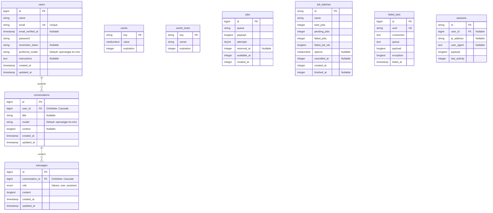

# Diagramme UML de la Base de Données - SurferAI

Ce document détaille la structure de la base de données relationnelle de l'application.

## Légende
- **PK** : Primary Key (Clé Primaire)
- **FK** : Foreign Key (Clé Étrangère)
- **UK** : Unique Key (Clé Unique)
- **||--o{** : Relation "Un à Plusieurs" (One-to-Many)
