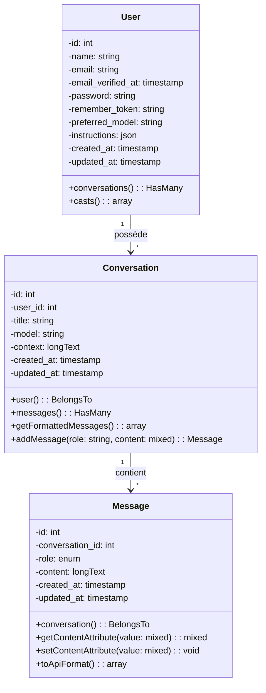
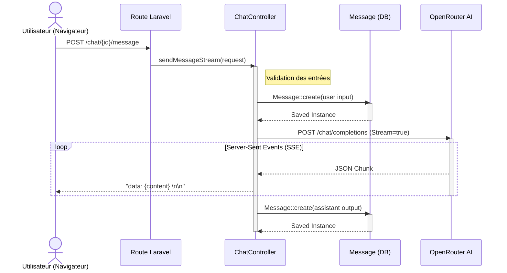
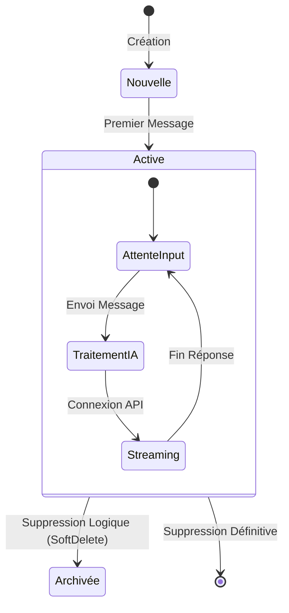
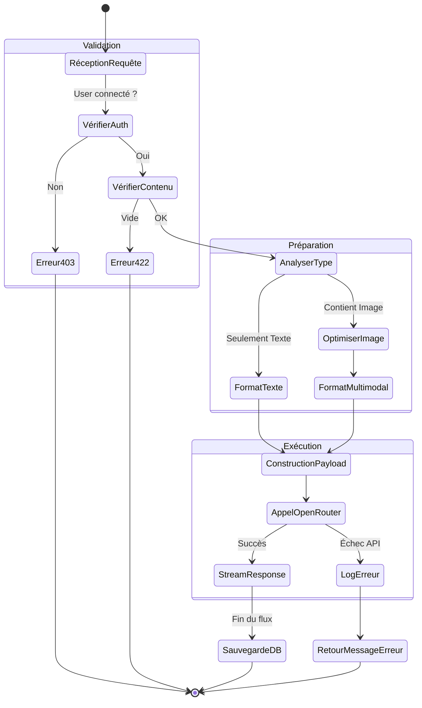

# Diagrammes UML - SurferAI

Ce document présente les 5 diagrammes UML principaux pour le projet SurferAI.

## 1. Diagramme de Classe (Class Diagram)
Ce diagramme détaille la structure des modèles de données (Entités), avec leurs attributs (issus de la base de données) et leurs méthodes (relations et logique métier), selon le formalisme standard.



## 2. Diagramme de Séquence (Sequence Diagram)
Représente les interactions temporelles lors de l'envoi d'un message par l'utilisateur et le traitement par le système (Streaming).



## 3. Diagramme d'État (State Diagram)
Illustre les différents états possibles d'une **Conversation** et les transitions entre eux.



## 4. Diagramme d'Activité (Activity Diagram)
Détaille l'algorithme de traitement d'un message utilisateur, incluant la logique conditionnelle (Texte vs Image) et la gestion d'erreurs.



## 5. Diagramme de Cas d'Utilisation (Use Case Diagram)
Vue d'ensemble des fonctionnalités offertes par le système aux acteurs.

```mermaid
usecaseDiagram
    actor "Visiteur" as Guest
    actor "Inscrit" as User
    actor "Admin" as Admin

    package "SurferAI System" {
        usecase "S'inscrire / Connexion" as UC_Auth
        usecase "Consulter Landing Page" as UC_View
        
        usecase "Gérer Conversations" as UC_Manage
        usecase "Discuter avec IA" as UC_Chat
        usecase "Changer de Modèle (GPT/Claude)" as UC_Config
        usecase "Uploader Fichiers" as UC_Upload
        
        usecase "Voir Dashboard" as UC_Dash
    }

    Guest --> UC_View
    Guest --> UC_Auth

    User --> UC_Auth
    User --> UC_Dash
    User --> UC_Manage
    User --> UC_Chat
    User --> UC_Config
    User --> UC_Upload

    %% Relations d'inclusion/extension
    UC_Chat ..> UC_Config : <<include>>
    UC_Upload ..> UC_Chat : <<extend>>
```
